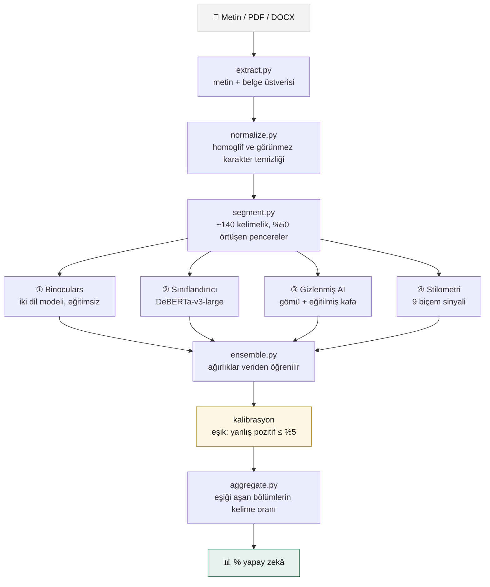

<div align="center">

# AIFinder

**Bir metnin hangi bölümlerinin yapay zekâ tarafından yazılmış olabileceğini
tahmin eden, tamamen yerel çalışan bir inceleme aracı.**

Türkçe ve İngilizce · PDF, Word ve düz metin · İnternet bağlantısı gerektirmez


</div>

---

> ### ⚠️ Önce bunu okuyun
>
> **Bu araç kanıt üretmez.** Hiçbir yöntem — bu dahil — bir metnin yapay zekâ
> ile yazıldığını kesin olarak kanıtlayamaz. Burada gördüğünüz, ölçülmüş bir
> olasılık tahminidir.
>
> Stanford'un 2023 tarihli çalışmasında (Liang ve ark., *Patterns*), yedi
> ticari detektör ana dili İngilizce olmayan kişilerin denemelerinin
> **%61'ini** yanlışlıkla "yapay zekâ" olarak işaretledi. Bu yanlılık
> gerçektir ve bu araçta da sıfırlanmış değildir.
>
> **Not verme, disiplin işlemi veya bir kişi hakkında karar almak için tek
> başına kullanmayın.**

---

## Ne yapar

Metni ya da belgeyi alır, **bölüm bölüm** inceler ve her bölüm için ayrı karar
verir. Sonuç tek bir "yapay zekâ mı değil mi" hükmü değil, belgenin yüzde
kaçının yapay zekâ üretimi göründüğüdür.

Bu ayrım önemli: yarısını insanın yazıp yarısını yapay zekâya tamamlattığı bir
belgede tek bir ortalama gerçeği gizler.

| | |
|---|---|
| 🔒 **Tamamen yerel** | Metin hiçbir sunucuya gönderilmez, internet gerekmez |
| 📄 **Belge okur** | PDF, DOCX, TXT, MD — ayrıca dosya üstverisini de inceler |
| 🧩 **Bölüm bazlı** | Karma belgelerde hangi kısmın nereden geldiğini gösterir |
| 🛡️ **Saldırıya dayanıklı** | Homoglif ve görünmez karakterle tespit atlatmayı yakalar |
| 📊 **Ölçülmüş** | Gösterilen doğruluk rakamları kendi ölçümümüzden gelir |
| 🚫 **"İnsan yazımı" demez** | İz bulamamak, iz olmadığı anlamına gelmez |

---

## Nasıl çalışır



### Temel fikir

Bir dil modeli metni kelime kelime üretirken her adımda **en olası
kelimelerden** birini seçer. Bu, üretimin doğasından gelen ölçülebilir bir iz
bırakır: çıktı istatistiksel olarak *öngörülebilir* olur.

```
"Sonuç olarak, bu konu büyük önem ..."  →  "taşımaktadır"  %68 olası   ← düşük şaşkınlık
"Kedim dün gece yine ..."               →  "kustu"          %0.3 olası  ← yüksek şaşkınlık
```

İnsan tuhaf kelime seçer, cümleyi yarıda keser, gereksiz detay verir. Tespitin
tamamı bu farkın üzerine kuruludur.

---

## Dört katman

Her katman bağımsız çalışır; hiçbiri tek başına yeterli değildir.

| Katman | Ne yapar | Neden var |
|---|---|---|
| **① Binoculars**<br/><sub>ICML 2024</sub> | İki dil modeli (Qwen2.5-1.5B temel + instruct) arasındaki perplexity oranı | **Eğitim gerektirmez** — daha önce görülmemiş modellere genelleşir. Sınıflandırıcıların en zayıf noktası budur. |
| **② Sınıflandırıcı** | `desklib/ai-text-detector-v1.01` (DeBERTa-v3-large, MIT, RAID lideri) | Bilinen üreticilerde en yüksek doğruluk |
| **③ Gizlenmiş AI** | Aynı modelin gömüleri üzerine eğittiğimiz küçük sınıflandırıcı | "İnsan gibi yaz" denilerek üretilmiş metinler için — mevcut katmanların tamamen kör kaldığı sınıf |
| **④ Stilometri** | Cümle ritmi, kalıp ifadeler, kelime çeşitliliği, noktalama (9 sinyal) | Tek başına zayıf, ama kararı **açıklayan** tek katman |

> **Ağırlıklar elle atanmaz.** Tüm sinyal kombinasyonları (tek, ikili, üçlü,
> dörtlü) ölçüm setinde denenir ve en iyisi veriden seçilir.

---

## Ölçülmüş doğruluk

Yanlış pozitif hedefi **%5**'te kalibre edilmiştir.

| Dil | Kullanılan sinyaller | ROC-AUC | Yakalama | Örneklem |
|---|---|---:|---:|---:|
| 🇹🇷 Türkçe | Binoculars + stilometri | 0,911 | %48,1 | 266 |
| 🇬🇧 İngilizce | Binoculars + sınıflandırıcı + gizlenmiş | 0,999\* | %100\* | 388 |

<sub>\* Bu rakam şişkindir — gizlenmiş katman ölçüm setindeki örneklerin bir
kısmı üzerinde eğitildi. Bağımsız doğrulama: RAID dışı veride AUC **0,987**,
yakalama **%95,0**. Ayrıntı için `eval/report.md`.</sub>

### Saldırı dayanıklılığı

Metin kasıtlı olarak bozulduğunda:

| Saldırı türü | Yakalama |
|---|---:|
| Homoglif <sub>(Latin harflerinin yerine Kiril/Yunan eşleri)</sub> | **%100** |
| Boşluk enjeksiyonu | **%100** |
| Parafraz | %65 |
| Eşanlamlı değiştirme | %40 |

<sub>Homoglif ve boşluk saldırıları normalizasyon katmanı eklenmeden önce
sırasıyla %3,3 ve %93,3 idi.</sub>

---

## Kurulum

```bash
git clone https://github.com/<kullanıcı>/aifinder.git
cd aifinder
python3 -m venv .venv
.venv/bin/pip install -r requirements.txt
```

İlk çalıştırmada modeller Hugging Face'ten indirilir (~5 GB, tek seferlik).

### Çalıştırma

```bash
.venv/bin/python app.py
```

Ardından **http://127.0.0.1:9317** adresini açın.

macOS'ta `AIFinder Başlat.command` dosyasına çift tıklamak da yeterlidir.

### Gereksinimler

| | |
|---|---|
| Python | 3.11+ |
| RAM | 16 GB önerilir |
| Disk | ~6 GB (modeller dahil) |
| Hızlandırma | Apple Silicon (MPS) veya CUDA — CPU'da da çalışır, yavaştır |

---

## Nasıl ölçtük

Bir modelin "0,73" demesi tek başına hiçbir şey ifade etmez. Projenin en çok
emek alan kısmı, o sayının **ne anlama geldiğini** ölçmekti.

### Eşik neden doğruluğa göre seçilmedi

Eşik, doğruluğu en yükseğe çıkarmak için değil, **yanlış suçlamayı en aza
indirmek** için seçilir: insan metinlerinin en fazla %5'inin aşabildiği nokta.

Bir yapay zekâ metnini kaçırmak ile bir insanı haksız yere suçlamak eşit
maliyetli hatalar değildir.

### Veri seti

| | Yapay zekâ | İnsan |
|---|---:|---:|
| 🇬🇧 İngilizce | 306 | 410 |
| 🇹🇷 Türkçe | 74 | 250 |

**Kaynaklar** — RAID ölçütü (11 üretici, 11 saldırı türü), Reddit gayriresmî
anlatılar, ttc4900 Türkçe haber derlemi, Türkçe Vikipedi, ürün yorumları ve
elle yazılmış "gizlenmiş" örnekler.

> **Kritik tasarım kararı:** İnsan tarafında **üslup eşleşmesi** şarttır.
> Gizlenmiş yapay zekâ örnekleri kişisel/denemesel üsluptayken insan tarafı
> yalnızca haber ve ansiklopedi metni olursa, model "yapay zekâ"yı değil
> "kişisel üslubu" öğrenir.

### Yeniden üretmek için

```bash
.venv/bin/python eval/build_human.py     # insan metinleri
.venv/bin/python eval/build_ai_en.py     # RAID'den İngilizce yapay zekâ metni
.venv/bin/python eval/build_ai_tr.py     # Türkçe yapay zekâ metinleri
.venv/bin/python eval/run_eval.py        # ölçüm  → eval/report.md
.venv/bin/python eval/calibrate.py       # kalibrasyon → engine/calibration.json
```

---

## Geliştirme sırasında bulunan hatalar

Hepsi "kod çalışıyor ama sonuç yanlış" türünden. Belgeleme amacıyla burada.

| Hata | Etkisi | Kök neden |
|---|---|---|
| **Eşik sıfıra yuvarlanıyordu** | Araç **her metni** yapay zekâ işaretlerdi | Mükemmel ayrımda eşik `0.0` kaydediliyor, `p >= 0` her zaman doğru oluyordu |
| **Isotonic kalibrasyon kararı eziyordu** | Açıkça yapay zekâ olan metin "insan" çıkıyordu | Ölçüm setinde ara değer olmadığı için eğri adım fonksiyonuna dönüşmüştü; gerçek metinler tam o boşluğa düşüyor |
| **Pencere boyutu kalibrasyonla uyumsuzdu** | Yarısı yapay zekâ olan belge %0 veriyordu | 140 kelimeyle kalibre edilip 300 kelimelik pencere besleniyordu |
| **Homoglif saldırısı tespiti çökertiyordu** | %3,3 yakalama | Latin harfleri görsel eşleriyle değişince tokenizer metni tanımıyor |
| **Ölçüm seti gerçeği yansıtmıyordu** | "%100 doğruluk" sahteydi | RAID'deki 81 yapay zekâ metninin hiçbiri zor değildi (medyan p = 1,000) |
| **Üç model aynı anda bellekteydi** | 16 GB makinede sistem takasa düşüyordu | Faz faz yükleme ile tepe bellek ~9 GB'dan ~6,5 GB'a indirildi |

---

## Bilinen sınırlar

- **Gizlenmiş metin.** Yapay zekâya "insan gibi yaz" denildiğinde üretilen
  metin, ölçülebilir imzasının çoğunu kaybeder. Bu sınıf için ③ katmanı
  eklendi, ancak yalnızca **İngilizce** çalışıyor.
- **Türkçe istatistiksel güç.** 74 Türkçe yapay zekâ örneği ile ölçülen
  rakamlar gürültülüdür; güvenilirlik için 200+ örnek gerekir.
- **Parafraz araçları** doğruluğu belirgin düşürür (%65).
- **Kısa metin** güvenilmezdir; 85 kelimenin altında karar verilmez.
- **Resmî/akademik üslupla yazan insanlar** yanlış pozitif riski taşır.
- Türkçe yapay zekâ örnekleri tek bir model ailesinden üretildi.

---

## Dizin yapısı

```
aifinder/
├── app.py                  Flask sunucusu
├── analyze.py              ana akış: metin → pencereler → dört katman → yüzde
├── extract.py              PDF/DOCX/TXT okuma + belge üstveri analizi
├── detector.py             ④ stilometri
├── engine/
│   ├── binoculars.py       ① Binoculars
│   ├── classifier.py       ② eğitilmiş sınıflandırıcı
│   ├── hidden.py           ③ gizlenmiş yapay zekâ tespiti
│   ├── normalize.py        saldırı normalizasyonu
│   ├── segment.py          pencereleme
│   ├── ensemble.py         kalibrasyonu uygular
│   ├── aggregate.py        pencerelerden belge yüzdesi
│   └── calibration.json    öğrenilmiş ağırlıklar + eşik
├── eval/                   ölçüm, kalibrasyon, veri toplama
│   └── report.md           ← doğruluk iddialarının tek kaynağı
├── static/index.html       arayüz
├── API.md                  arayüz ↔ sunucu sözleşmesi
└── UI-METINLERI.md         arayüzde kullanılacak açıklama metinleri
```

---

## Kaynaklar

- **Binoculars** — Hans ve ark., *Spotting LLMs With Binoculars: Zero-Shot
  Detection of Machine-Generated Text*, ICML 2024 · [arXiv:2401.12070](https://arxiv.org/abs/2401.12070)
- **RAID ölçütü** — Dugan ve ark., *RAID: A Shared Benchmark for Robust
  Evaluation of Machine-Generated Text Detectors*, ACL 2024 · [arXiv:2405.07940](https://arxiv.org/abs/2405.07940)
- **Yanlış pozitif yanlılığı** — Liang ve ark., *GPT detectors are biased
  against non-native English writers*, **Patterns** 2023
- **Sınıflandırıcı** — [desklib/ai-text-detector-v1.01](https://huggingface.co/desklib/ai-text-detector-v1.01) (MIT)
- **Dil modelleri** — [Qwen2.5-1.5B](https://huggingface.co/Qwen/Qwen2.5-1.5B) (Apache-2.0)

---

<div align="center">
<sub>Bu araç bir olasılık tahmin eder, hüküm vermez.</sub>
</div>
